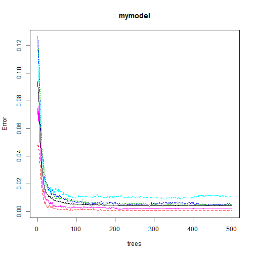

Building activity class prediction based on human activity data
========================================================

Here we try to build model to predict activity class based on measurment from wearable sensors like Jawbone and etc.
We use data from  http://groupware.les.inf.puc-rio.br/har. There are 19622 samples from 6 people in dataset. For classification we will use random forest algorithm.

Clean-up data set
==

First we will load and clean-up our test set.

```r
TrainData<-read.csv("pml-training.csv")
summary(colSums(is.na(TrainData)))
```

```
##    Min. 1st Qu.  Median    Mean 3rd Qu.    Max. 
##       0       0       0    8050   19200   19200
```

```r
summary(colSums(TrainData == ""))
```

```
##    Min. 1st Qu.  Median    Mean 3rd Qu.    Max.    NA's 
##       0       0       0    6820   19200   19200      67
```
We can see that number of NA's and empty strings in our data is equal for each column where ots presented, and it's more than 95% of data set. We can easy remove all that column


```r
my_cols<-colSums(TrainData == "")
my_cols[is.na(my_cols)]<-19000
my_cols<-my_cols==0
CleanedTrainData<-TrainData[,my_cols]
```
Next we can remove timestamp, username, window-related info and number of experiment which will not have any usefull information

```r
CleanedTrainData<-CleanedTrainData[,8:60]
```

Fit Model
==
We will use random forest to fit our model with default parameters. 
We divide our date into train and test set (70% and 30% resp.) and fit the model

```r
library(randomForest)
```

```
## randomForest 4.6-7
## Type rfNews() to see new features/changes/bug fixes.
```

```r
set.seed(987)
splitInd<-rbinom(19622, 1, 0.3)==1
TrainSet<-CleanedTrainData[!splitInd,]
TestSet<-CleanedTrainData[splitInd,]
mymodel<-randomForest(classe~., data = TrainSet)
```
We get model, lets take a look

```r
mymodel$ntree
```

```
## [1] 500
```

```r
colMeans(mymodel$err.rate)
```

```
##      OOB        A        B        C        D        E 
## 0.006646 0.001875 0.008803 0.008971 0.013074 0.004023
```

```r
mymodel$confusion
```

```
##      A    B    C    D    E class.error
## A 3894    2    0    0    0   0.0005133
## B   10 2660    3    0    0   0.0048634
## C    0   11 2356    1    0   0.0050676
## D    0    0   22 2149    2   0.0110446
## E    0    0    1    5 2528   0.0023678
```

```r
summary(mymodel)
```

```
##                 Length Class  Mode     
## call                3  -none- call     
## type                1  -none- character
## predicted       13644  factor numeric  
## err.rate         3000  -none- numeric  
## confusion          30  -none- numeric  
## votes           68220  matrix numeric  
## oob.times       13644  -none- numeric  
## classes             5  -none- character
## importance         52  -none- numeric  
## importanceSD        0  -none- NULL     
## localImportance     0  -none- NULL     
## proximity           0  -none- NULL     
## ntree               1  -none- numeric  
## mtry                1  -none- numeric  
## forest             14  -none- list     
## y               13644  factor numeric  
## test                0  -none- NULL     
## inbag               0  -none- NULL     
## terms               3  terms  call
```

```r
plot(mymodel)
```

 
We can see that classifier is pretty precise — error rate is smaller than 0.5%.

And now get error rate for test and training sets

```r
trainPrediction<-predict(mymodel, TrainSet)
testPrediction<-predict(mymodel, TestSet)
trainError = sum(trainPrediction!=TrainSet[,53])/length(trainPrediction)
testError = sum(testPrediction!=TestSet[,53])/length(testPrediction)
trainError
```

```
## [1] 0
```

```r
testError
```

```
## [1] 0.006524
```

We can see that error rate is also very small for test set, so classifier is pretty efficient at all.

Additional Insights
==
Probably we can clean up confusion matrix by include "user_name" in the prediction, but this will confuse model when we try to predict activity for new user. Also efficency of prediction for new user is not guarantied.

